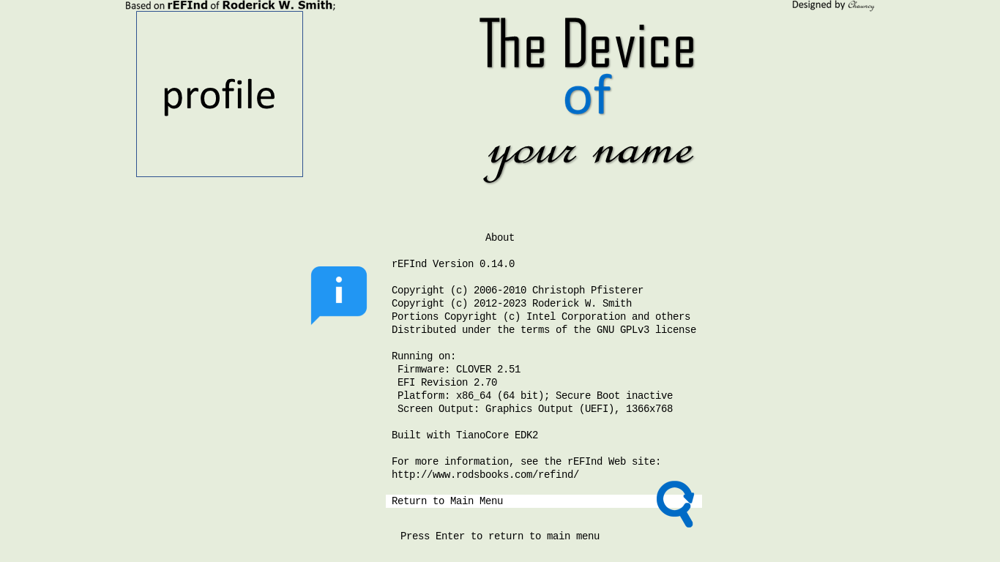

[English](README.md)|[简体中文](自述文件.md)|[繁體中文](繁體中文.md)
--|--|--
# Yours-LegacyBIOS
Your own usual rEFInd's sign for LegacyBIOS.
#### Your device should meet the requirements,
- NOT supporting 64bit UEFI,
- - 32bit UEFI supported;
- - Only Legacy BIOS without UEFI supported;
- GPU/vBIOS UEFI not supported; (See the picture) 

- GPT disk;
- Internal SATA disk, NOT NVMe or USB Storage;
- - It seems that DUET of CloverBootloader supports only SATA, NOT NVMe or USB;
#### Working Principle
[__Power On__]=>[__Legacy BIOS__]=>[__MBR__]=>[__PBR__]=>[__CLOVERX64.EFI__(`refind_x64.efi` renamed)]=>[__Yours__]
## 💻️Preview👀

🖱️Click to Unfold to see🖱️

## 🧭Guide⬇️

🖱️Click to Unfold to see🖱️

It need use [DiskGenius](https://www.diskgenius.com/) and Bootice.
### Convert MBR to GPT
__Note__: All I have prepared is for GPT partition table, because I do NOT use MBR partition table. 
If your disk has been already GPT, You shall __SKIP__ this step.

🖱️Click to Unfold to see🖱️

https://www.diskgenius.com/manual/convert-partition-table-style.php

### Cover Boot Record

🖱️Click to Unfold to see🖱️

#### Backup EFI files
- Open DiskGenius;
- Copy all files from ESP to somewhere else you would like;
#### Format ESP as FAT32
- Open DiskGenius;
- Format ESP as FAT32(Basic data partition);
- - Or create a FAT32 before the first partition;
#### Cover MBR and PBR
- Open Bootice;
- `\Boot_Record\MBR.bin` covers MBR of Internal SATA disk;
- `\Boot_Record\PBR.bin` covers PBR of that FAT32;
#### Turn FAT32 into ESP
- Open DiskGenius;
- [Modify partition parameters](https://www.diskgenius.com/manual/modify-partition-para.php), set the FAT32 as ESP;
- Name it `EFI system partition`(See the picture) 

 
### Manage ESP

🖱️Click to Unfold to see🖱️

- Restore EFI files from your backup into ESP.
#### For Hackintosh
If you want,
- graphical interface is going to be not interrupted by codes;
- CloverBootloader does not conflict with Yours;
https://github.com/M-L-P/Yours#the-icon-of-hackintosh

## ⭐Star🌟
If you like it and are looking forward to the coming update, you can star it.💫

## 🎉Credit🎊
- 
