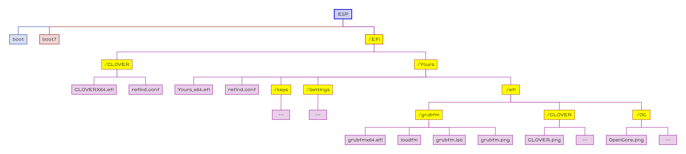

[English](README.md)|[简体中文](自述文件.md)|[繁體中文](繁體中文.md)|...
--|--|--|--

# Yours-LegacyBIOS
Your own usual rEFInd's sign for LegacyBIOS. 
依賴於 [CloverBootloader](https://github.com/CloverHackyColor/CloverBootloader) 的 DUET，Legacy BIOS 能夠運行 rEFInd。 
它能夠拯救你的舊電腦，使其支持 64位 的 UEFI，化腐朽為神奇。
#### 你的設備滿足以下情況中的一種，
- 不支持 64bit UEFI，
- - 支持 32bit UEFI；
- - 僅支持 Legacy BIOS，不支持 UEFI；
- GPU/vBIOS 不支持 UEFI；(如下圖) 

- GPT 磁盤；
- 內置 SATA 硬盤, 並非 NVMe 或 USB 的；
- - 似乎 CloverBootloader 的 DUET 僅支持 SATA，不支持 NVMe 或 USB；
#### 工作原理
[Power On]=>[Legacy BIOS]=>[MBR]=>[PBR]=>[`boot`]=>[`CLOVERX64.EFI`(`refind_x64.efi` renamed)]=>[Yours]
#### 文件結構樹狀圖

## 💻️預覽👀

🖱️點擊展開查看🖱️

## 🧭指南⬇️

🖱️點擊展開查看🖱️

需要使用 [DiskGenius](https://www.diskgenius.com/) 和 BOOTICE。
### 轉化 MBR 為 GPT
__註意__: 所有文件是為 GPT 分區表準備的，因為我不使用 MBR 分區表。 
如果你的硬盤已經是 GPT 的，你要 __跳過__ 這個步驟。

🖱️點擊展開查看🖱️

https://www.diskgenius.com/manual/convert-partition-table-style.php

### 覆蓋引導記錄

🖱️點擊展開查看🖱️

#### 備份 EFI 文件
- 打開 DiskGenius；
- 把 ESP分區 中的所有的文件 復製到其他你想要的位置；
#### 格式化 ESP 成 FAT32
- 打開 DiskGenius；
- 格式化 ESP 成 FAT32(Basic data partition)；
- - 或者 在第一個分區前面 創建一個 FAT32 分區。
#### 覆蓋 MBR 和 PBR
- 打開 BOOTICE；
- `zip: Boot_Record\MBR.bin` 用來覆蓋內置 SATA 硬盤的 MBR； 
  

- `zip: Boot_Record\PBR.bin` 用來覆蓋 FAT32 的 PBR； 
  

#### 把 FAT32 變成 ESP
- 打開 DiskGenius；
- [編輯分區參數](https://www.diskgenius.com/manual/modify-partition-para.php), set the FAT32 as ESP；
- 命名為 `EFI system partition`(如下圖) 

### 調整 ESP 分區

🖱️點擊展開查看🖱️

#### 恢復 EFI 文件
- 從你的備份中把 EFI 文件恢復進 ESP 分區。

#### 復製 Yours 到 ESP 分區
- 復製文件 `zip: boot` 到 `ESP: \`；
- 復製文件夾 `zip: EFI\CLOVER` 到 `ESP: \EFI`；
- 復製文件夾 `zip: EFI\Yours` 到 `ESP: \EFI`；

#### 若有 黑蘋果
如果你想要，
- 讓圖形界面銜接得更加緊密，中途沒有代碼界面；
- CloverBootloader 不與 Yours 發生沖突；

你需要執行以下步驟。

🖱️點擊展開查看🖱️

##### 若是 OpenCore
- 編輯 `config.plist` 設置 `LauncherOption=System` ；
- 剪切 EFI 相關文件，粘貼到 `EFI\Yours\efi\OC` ；
- 編輯 `refind.conf` ，刪除 位於`include /EFI/Yours/Settings/menuentry/examples/OpenCore.conf` 前面的 `#`；

##### 若是 CloverBootloader
- 剪切 EFI 相關文件，粘貼到 `EFI\Yours\efi\CLOVER` ；
- 編輯 `refind.conf` ，刪除 位於 `include /EFI/Yours/Settings/menuentry/examples/CLOVER.conf` 前面的 `#`；

## ⭐收藏🌟
如果你喜歡並且期待未來的更新，你可以點亮星星。💫

## 🎉來源🎊
- *Roderick W. Smith* 的 [rEFInd Boot Manager](http://www.rodsbooks.com/refind/)；
- [a1ive](https://github.com/a1ive) 的 [grub2-filemanager](https://github.com/a1ive/grub2-filemanager)；
- [CloverBootloader](https://github.com/CloverHackyColor/CloverBootloader) 的 DUET；

## 🧁請我吃塊巧克力🍫
我沒有父親；沒人給我過生日；沒人為我買蛋糕🎂。 
如果你願意，請我吃塊巧克力🍫。 
我需要巧克力🍫幫助我釋放內啡肽與多巴胺來緩解痛苦。 
我將會非常感謝您，仙女姐姐🧚‍ 或 玉樹豪俠🦸‍♂️。

